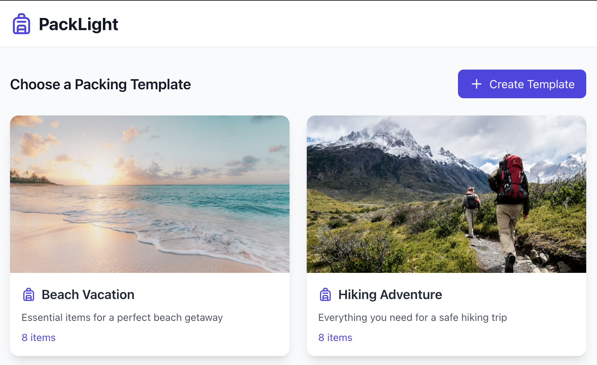

# PackLight 🎒

PackLight is a modern, user-friendly packing list application built with React and TypeScript. Create and manage packing lists using pre-made templates or create your own custom templates for different types of trips and activities.

## 🌐 Live Preview

Check out the live application: [PackLight Demo](https://pack-light-lovat.vercel.app/)

## 📸 Preview



## Features ✨

- 📝 Pre-made packing list templates
- ✨ Create custom templates
- ✅ Track packing progress
- 🗂️ Organize items by categories
- 📱 Responsive design
- 💾 Local storage persistence

## Technologies Used 🛠️

- React
- TypeScript
- Tailwind CSS
- Lucide Icons
- Local Storage API

## Getting Started 🚀

1. Clone the repository:
```bash
git clone https://github.com/PStarH/packlight.git
```

2. Install dependencies:
```bash
cd packlight
npm install
```

3. Start the development server:
```bash
npm run dev
```

4. Open [http://localhost:5173](http://localhost:5173) in your browser.

## Usage 📖

1. Choose a template or create your own custom template
2. Add/remove items to your packing list
3. Organize items by categories
4. Check off items as you pack
5. Track your packing progress

## Contributing 🤝

Contributions are welcome! Please feel free to submit a Pull Request.

## License
MIT License